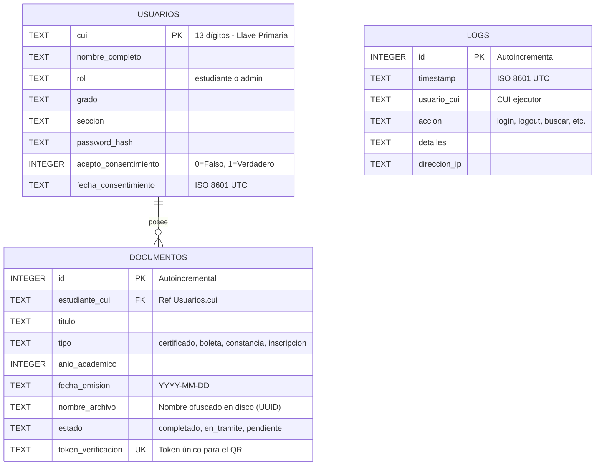

# 🗃️ Base de Datos y Formato JSON - Estructuras de Datos

Este documento define la estructura de las tablas relacionales de la base de datos SQLite (`sistema.db`) y el formato del archivo de configuración JSON (`initial_data.json`).

---

## 🗄️ 1. Esquema de Base de Datos (SQLite)

La base de datos se almacena localmente en la ruta del proyecto y consta de tres tablas relacionadas: `usuarios`, `documentos` y `logs`.



### Script SQL de Inicialización (`database.py`)
```sql
-- Tabla de Usuarios
CREATE TABLE IF NOT EXISTS usuarios (
    cui TEXT PRIMARY KEY,
    nombre_completo TEXT NOT NULL,
    rol TEXT NOT NULL,
    grado TEXT,
    seccion TEXT,
    password_hash TEXT NOT NULL,
    acepto_consentimiento INTEGER DEFAULT 0,
    fecha_consentimiento TEXT
);

-- Tabla de Documentos Académicos
CREATE TABLE IF NOT EXISTS documentos (
    id INTEGER PRIMARY KEY AUTOINCREMENT,
    estudiante_cui TEXT NOT NULL,
    titulo TEXT NOT NULL,
    tipo TEXT NOT NULL,
    anio_academico INTEGER NOT NULL,
    fecha_emision TEXT NOT NULL,
    nombre_archivo TEXT NOT NULL,
    estado TEXT NOT NULL,
    token_verificacion TEXT NOT NULL UNIQUE,
    FOREIGN KEY (estudiante_cui) REFERENCES usuarios (cui)
);

-- Tabla de Logs de Auditoría
CREATE TABLE IF NOT EXISTS logs (
    id INTEGER PRIMARY KEY AUTOINCREMENT,
    timestamp TEXT NOT NULL,
    usuario_cui TEXT NOT NULL,
    accion TEXT NOT NULL,
    detalles TEXT,
    direccion_ip TEXT
);
```

---

## 📄 2. Formato del Archivo de Carga Inicial (`initial_data.json`)

El sistema utiliza un archivo JSON para la carga predeterminada del sistema escolar. Esto desacopla los registros de prueba y las configuraciones base de la codificación en Python.

### Estructura del JSON:
El archivo se divide en tres secciones clave:
1.  `system_config`: Parámetros de configuración general.
2.  `default_users`: Listado de estudiantes y administradores que se registrarán en la inicialización.
3.  `default_documents`: Listado de documentos precargados y asociados a los CUIs estudiantiles.

```json
{
  "system_config": {
    "app_name": "Sistema de Consulta de Documentos Escolares",
    "country": "Guatemala",
    "cui_length": 13,
    "session_timeout_minutes": 15
  },
  "default_users": [
    {
      "cui": "2810452310101",
      "nombre_completo": "Juan Pérez Gómez",
      "rol": "estudiante",
      "grado": "3ro Básico",
      "seccion": "A",
      "password": "1234",
      "acepto_consentimiento": false
    }
  ],
  "default_documents": [
    {
      "estudiante_cui": "2810452310101",
      "titulo": "Certificado de Estudios 2025",
      "tipo": "certificado",
      "anio_academico": 2025,
      "fecha_emision": "2025-11-20",
      "nombre_archivo": "cert_2025_2810452310101.pdf",
      "estado": "completado",
      "token_verificacion": "tok_juan_cert_2025",
      "details": "Aprobado con promedio de 92.5 puntos sobre 100."
    }
  ]
}
```

---

## ⚙️ 3. Transacción y Población de Datos (`populate_db.py`)
Cuando se ejecuta el script de población, se siguen los siguientes pasos transaccionales:
1.  **Limpieza:** Se borra el archivo `sistema.db` y se elimina la carpeta de documentos `/app_docs`.
2.  **Lectura:** Se lee y decodifica `initial_data.json` con codificación UTF-8.
3.  **Usuarios:** Se insertan los estudiantes cifrando su PIN con la función `hash_password()`.
4.  **Simulación:** Para cada documento, se genera un archivo físico PDF en `/app_docs` escribiendo binarios conformes al estándar PDF-1.4 simplificado.
5.  **Documentos:** Se insertan los metadatos de los documentos en la base de datos relacional.
6.  **Logs:** Se escribe el log de auditoría inicial.
